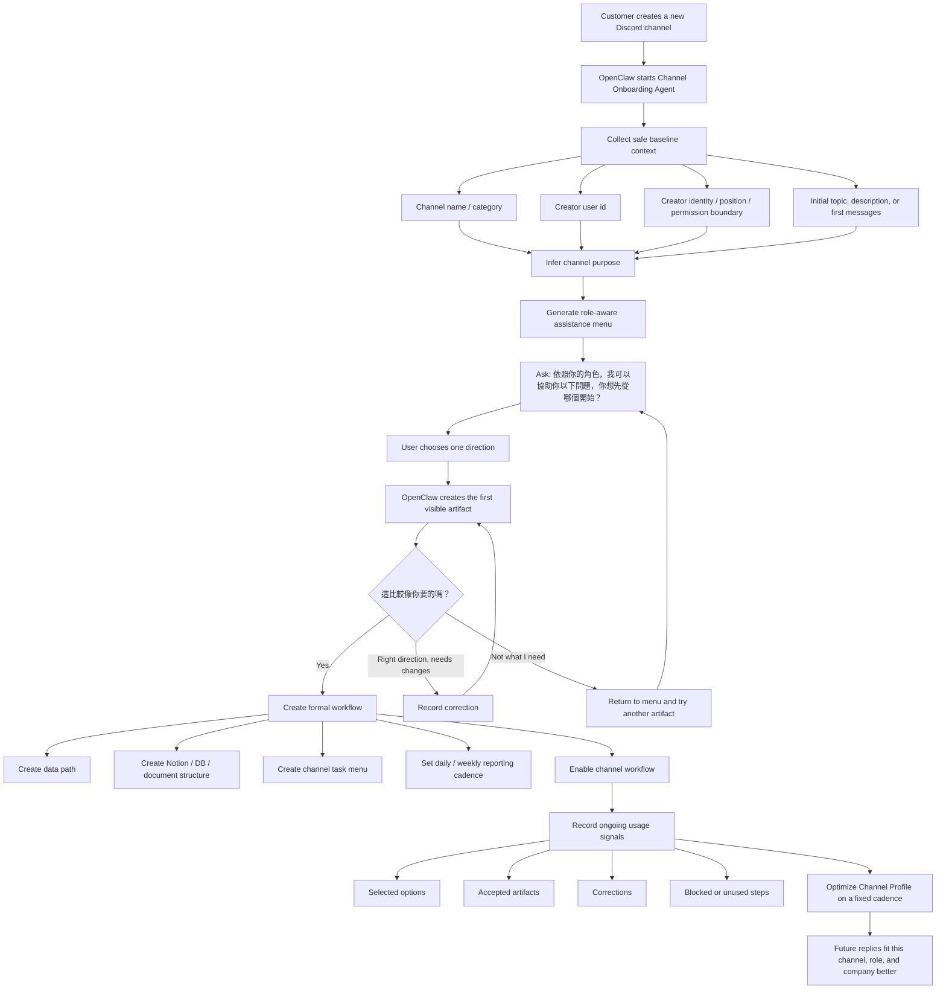

# Channel Onboarding Agent

## Purpose

The Channel Onboarding Agent turns a newly created Discord channel into a guided, role-aware OpenClaw workflow entry point.

It must not ask customers to invent prompts or state a mature AI strategy upfront. Many customer-side managers and staff do not yet know what AI can help with. The agent should infer, offer options, produce a first visible artifact, then learn from corrections.

## Trigger

When a new customer Discord channel is created, log or create a channel onboarding profile with:

- channel id, name, category, and initial description/topic
- creator user id
- creator identity / role / position
- permission boundary when available
- creator's initial statements and later corrections, redacted
- inferred channel purpose and confidence
- selected assistance options
- generated artifacts and accepted/corrected outcomes
- blocked points and recommended next workflow

## Onboarding flow

1. Infer the channel scene from channel name/category/topic.
2. Ask or confirm the creator's role/position.
3. Present role-aware options using this framing:

   > 依照你的角色，我可以協助你以下問題，你想先從哪個開始？

4. Offer a visible first artifact instead of asking for a complete prompt.
5. Ask whether the artifact is close enough:

   > 這比較像你要的嗎？

6. If accepted, create or update the data path, Notion path, workflow profile, report cadence, and channel usage menu.
7. If corrected, record the correction as evidence for fixed optimization.

## Role-aware examples

For the same `客服` channel:

- CEO / owner: customer-risk summary, revenue-impact risk, high-risk complaint alerts, weekly customer health report.
- Manager: repeated issues, response quality variance, unresolved cases, improvement report.
- Frontline support: response drafts, FAQ lookup, customer issue summarization, special-case escalation.

## Fixed optimization

Nightly learning should update channel recommendations from:

- selected options
- accepted artifacts
- repeated corrections
- low usage / no-reply channels
- task types observed in the channel
- role-specific friction

Identity, permission, RLS, secrets, and sensitive raw details must never auto-apply. They should stay pending or require administrator review.

## Formal flowchart v1

### Flow principle

When a new channel is created, OpenClaw should not ask `What do you want to do?` first. It should infer the likely purpose from the channel, creator identity, position, and permission boundary; then offer role-aware options, produce a visible artifact, and let the user confirm or correct from there.
